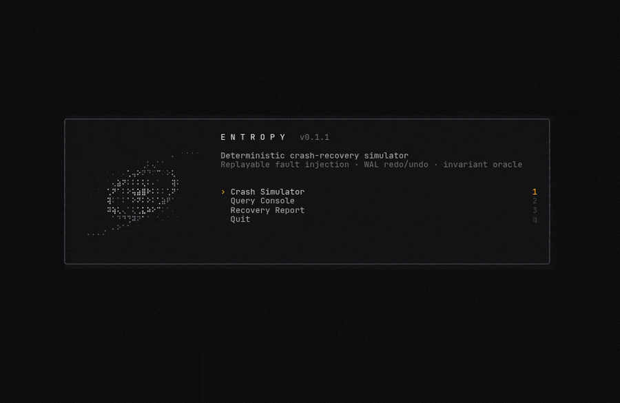
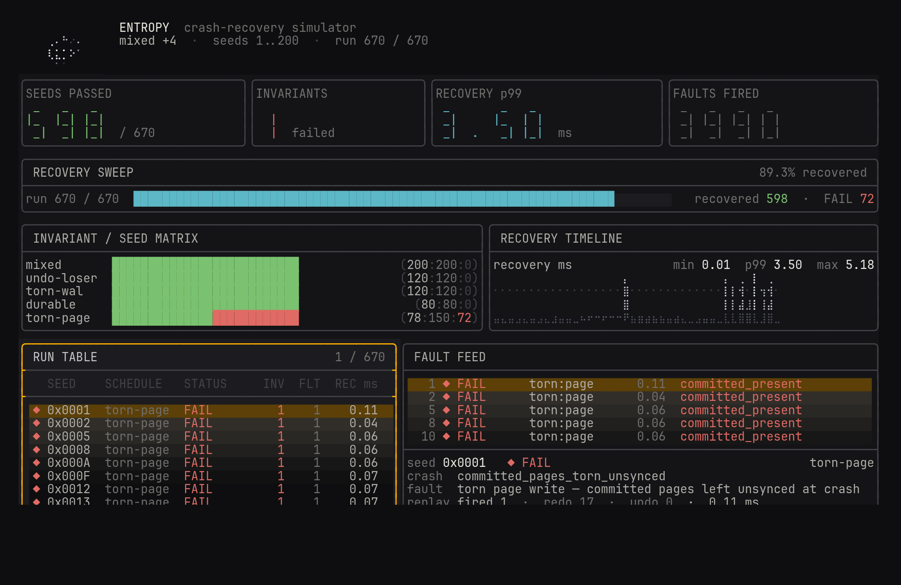
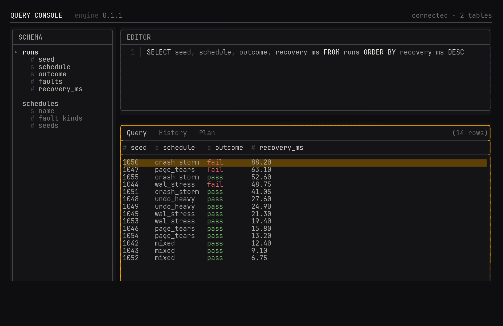

<p align="center">
  
  
</p>

---

[](https://github.com/ShreeChaturvedi/entropy/actions/workflows/ci.yml)
[](https://github.com/ShreeChaturvedi/entropy/releases)
[](LICENSE)
[](https://isocpp.org/)

<p align="center">
  
</p>

<p align="center">
  <em>The Entropy terminal UI at boot.</em>
</p>

Entropy is a high-performance relational database engine built from scratch in
modern C++20. It showcases core database internals: slotted-page storage, a
latch-crabbing B+ tree, MVCC snapshot isolation, ACID transactions, write-ahead
logging with ARIES-style crash recovery, and a cost-based query optimizer, all
exercised by a deterministic, FoundationDB-style crash simulator.

## Highlights

- SQL engine: parser, binder, cost-based optimizer, executors.
- Storage: slotted-page heap, latch-crabbing B+ tree, buffer pool.
- ACID transactions: MVCC snapshot isolation, WAL, ARIES recovery.
- CRC-32 checksums catch torn writes and bit rot, on by default.
- Deterministic crash simulator: seeded faults, invariant checks.
- Unit and integration tests on CTest + GoogleTest.
- Benchmarks vs SQLite with reproducible scripts.
- CI across Linux/macOS/Windows, ASan/UBSan/TSan, `find_package` smoke.

## Terminal UI

The engine drives a live terminal UI, rendered amber on charcoal.

<p align="center">
  
</p>

<p align="center">
  <em>Live crash-simulator dashboard: seed runs and pass/fail beside a streaming fault feed with btop-style row lighting.</em>
</p>

<p align="center">
  
</p>

<p align="center">
  <em>Interactive SQL console: type a query, read the result grid.</em>
</p>

## Architecture

<p align="center">
  
  
</p>

## Architecture Details

Entropy is organized as focused C++ libraries that mirror the logical
database pipeline. The system is split into layers with explicit boundaries.

### SQL Frontend

- Hand-written recursive-descent parser builds an AST for SELECT, INSERT, UPDATE,
  DELETE, CREATE TABLE, CREATE INDEX, DROP TABLE, DROP INDEX, and EXPLAIN.
- Binder resolves names and types against catalog metadata and rejects type
  errors at bind time (for example comparing a string column to a numeric literal).

### Planning and Optimization

- Statistics track row counts and simple selectivity estimates.
- Cost model compares index scans and sequential scans for predicates.
- Index selector chooses point lookup and range scan paths when an index exists.
- Join method is chosen by cost: hash join for equi-joins, nested loop otherwise.

### Execution

- Iterator operators for seq scan, index scan, hash join, nested loop join, sort, aggregate, filter, and limit.
- Projection and DML executors materialize rows and apply insert, update, and delete.

### Transactions and Recovery

- MVCC version store with snapshot-isolation visibility and first-updater-wins
  write-write conflict detection.
- Lock manager with wait-for-graph deadlock detection and wait-die victim
  selection. Rollback undoes writes through compensation log records.
- Write-ahead log is fsync'd on commit. ARIES-style recovery runs analysis,
  redo, and undo phases, anchored at the last checkpoint with page-LSN-gated redo.

### Storage and Buffering

- Slotted pages back a table heap for variable length tuples.
- B+ tree and extendible hash indexes support range and point access.
- Buffer pool uses an LRU replacer with pin and dirty tracking.
- Disk manager handles page and WAL IO and verifies a CRC-32 checksum on every
  page read, so torn writes and bit rot surface as an explicit corruption error.

## Crash Simulation

Entropy ships with a deterministic, FoundationDB-style crash simulator that
drives the engine through fault-injected storage and replays failures from a
seed. Every run is reproducible: one 64-bit seed fans out into independent PRNG
streams for the workload, the page device, and the log store, so a failing
schedule replays byte for byte.

- `SimDiskManager` and `SimLogStore` stand in for the file backend and model a
  durability boundary at `fsync`. On a simulated crash, unsynced page and log
  writes resolve to lost, torn, or durably-kept outcomes, and transient write
  errors can be injected on the way there.
- Named, replayable schedules place the crash at specific points, for example
  between the WAL flush and the page flush, or partway through the WAL tail.
- After each crash the harness reopens the database, runs recovery, and checks
  invariants against an oracle: every committed row is present byte for byte,
  and no uncommitted or rolled-back write is visible.

Run a sweep of seeds:

```bash
entropy-sim --seeds 100 --schedule mixed
entropy-sim --list          # list available schedules
```

Each run appends one JSONL line (faults fired, redo/undo work, invariant
results) so a whole sweep is machine-checkable. The suite runs in CI.

## Performance Snapshot (vs SQLite)

Run file: `docs/benchmarks/runs/bench-20251226-214051.json`

- Machine: Apple M2 (arm64), macOS 15.5
- Compiler: Apple clang 17.0.0 (clang-1700.0.13.5)
- Build: Release (`-O3`)
SQLite baselines are collected when `ENTROPY_BENCH_COMPARE_SQLITE=ON`.

<!-- numbers pending re-measure: durable-vs-durable run in progress -->
Per-iteration ns/op (ratio = Entropy / SQLite, lower is better):

| Case | Rows | Entropy (ns/op) | SQLite (ns/op) | Ratio |
| --- | --- | --- | --- | --- |
| Insert batch (txn) | 1k | `940,970` | `1,048,274` | `0.90x` |
| Insert batch (txn) | 10k | `9,693,951` | `6,992,261` | `1.39x` |
| Point select | 1k | `46,041` | `23,020` | `2.00x` |
| Point select | 10k | `459,723` | `179,783` | `2.56x` |

Rows are the batch size for inserts and the table cardinality for point selects.


Chart units are microseconds per op. The insert and point select panels use different y axis ranges.

Full results: `docs/benchmarks/bench_summary.csv`

## Benchmarks

```bash
./scripts/bench/run.sh
```

Windows:

```powershell
powershell -ExecutionPolicy Bypass -File scripts/bench/run.ps1
```

The script writes a timestamped JSON run file in `docs/benchmarks/runs/` and
updates `docs/benchmarks/bench_summary.csv`.

SQLite comparison is ON by default for the script. If SQLite3 headers are
missing, the script fails with an explicit error. To run without SQLite,
set `ENTROPY_BENCH_COMPARE_SQLITE=OFF`. Manual steps and methodology are in
`docs/benchmarks.md`.

## Quick Start

```cpp
#include <entropy/entropy.hpp>
#include <iostream>

int main() {
    entropy::Database db("mydb.entropy");
    db.execute("CREATE TABLE users (id INT, name VARCHAR(100))");
    db.execute("INSERT INTO users VALUES (1, 'Alice')");

    auto result = db.execute("SELECT * FROM users");
    for (const auto &row : result) {
        std::cout << row["name"].as_string() << "\n";
    }
}
```

## Build and Test

### Prerequisites

- C++20 compiler (GCC 10+, Clang 12+, MSVC 19.29+)
- CMake 3.20+
- Git

### Configure + Build

Dependencies (spdlog, GoogleTest, Google Benchmark) are fetched with CMake
FetchContent on first configure (requires network access). Optional
comparisons use system SQLite3.

```bash
cmake -S . -B build -DCMAKE_BUILD_TYPE=Release
cmake --build build --config Release
```

### Run Tests

```bash
ctest --test-dir build --output-on-failure -C Release
```

### CMake Presets

```bash
cmake --preset dev
cmake --build --preset dev
ctest --preset dev
```

## Build Options

| Option | Default | Description |
| --- | :---: | --- |
| `ENTROPY_BUILD_TESTS` | &#10003; | Build unit + integration tests |
| `ENTROPY_BUILD_BENCHMARKS` | &#10007; | Build benchmarks |
| `ENTROPY_BENCH_COMPARE_SQLITE` | &#10007; | Build SQLite comparison benchmarks |
| `ENTROPY_BUILD_EXAMPLES` | &#10003; | Build example programs |
| `ENTROPY_ENABLE_ASAN` | &#10007; | Build with AddressSanitizer |
| `ENTROPY_ENABLE_TSAN` | &#10007; | Build with ThreadSanitizer |

## CI/CD and Releases

- CI builds and tests on Linux/macOS/Windows via GitHub Actions.
- AddressSanitizer + UBSan and ThreadSanitizer jobs run the full suite on Linux.
- A downstream job installs the package and consumes it through
  `find_package(entropy)` linking `entropy::entropy`, proving the exported
  package config is usable.
- Releases are created automatically on `v*` tags with OS-specific binaries.

## Roadmap

The primary-key and heap path is the source of truth and always reflects
writes, so sequential scans and the transactional engine are always correct.
Secondary indexes are scoped roadmap work:

- Equality on a non-unique indexed column returns a single row, and index build
  drops duplicate keys ([#8](https://github.com/ShreeChaturvedi/entropy/issues/8)).
- INSERT, UPDATE, and DELETE do not yet maintain secondary indexes, so an index
  can desync from the heap after writes ([#11](https://github.com/ShreeChaturvedi/entropy/issues/11)).

## Documentation

- `DESIGN.md` for architecture notes and component details
- `docs/benchmarks.md` for benchmark methodology and reporting

## License

MIT. See `LICENSE`.
